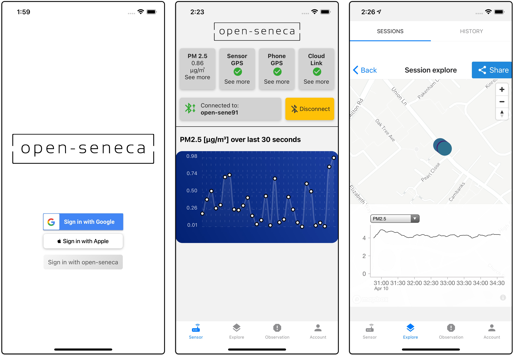

# A smartphone app to monitor and upload readings from your open-seneca sensor unit

[](https://github.com/user/repo)

Open-Seneca is a React-Native application designed to connect to an Open-Seneca sensor hub via Bluetooth. It allows you to monitor air quality sensor readings from your phone, saving the data privately accessible by you in the cloud.



## Firmware

Please make sure your Open-Seneca sensor is running the latest firmware, which can be found on GitHub [here](https://open-seneca.org/github).

## Requirements

- [Node.js](https://nodejs.org/)
- [React-Native CLI](https://reactnative.dev/docs/environment-setup)

## Installation

1. Clone this repository

```bash
git clone https://github.com/user/repo
```

2. Navigate to the project root directory and install the dependencies

```bash
cd open-seneca
npm install
```

## Scripts

- **Start the app**: `npm run start`
- **Run Android**: `npm run android`
- **Build Android bundle**: `npm run bundle-android`
- **Run iOS**: `npm run ios`
- **Test**: `npm run test`
- **Lint**: `npm run lint`

## Dependencies

Open-Seneca uses a number of open-source packages:

- React-Native, along with several plugins for enhanced functionality.
- Background geolocation and native geolocation for location tracking.
- Various UI components from React-Native-Elements.
- Google & Apple Sign-In integration.
- Firebase for authentication.
- And many more...


## License

[GPLv3](LICENSE.md)

## Contact

- GitHub [@charlesnchr](https://github.com/charlesnchr)
